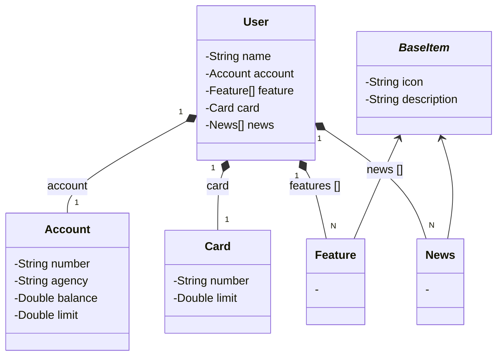

# PROJETO API BOOTCAMP SANTANDER/DIO 

### Este projeto teve base a criação de usuários de um banco, através de metodos HTTP como:

* GET: para buscar informações de usuários pelo seu respectivo ID;
* POST: para savar usuários passando as informações através de um JSON e com seu ID sendo gerado automaticamente;
* PUT: para atualizar as informações de um usuário através do ID, com Exceções que o impedem de modificar numero da conta;
* DDELETE: para deletar um usuário através do seu ID.

## Diagrama de Classes

# Documentação

Toda a documentação deste projeto esta baseada no uso Swagger onde ele mapeia os métodos  
HTTP usados e nos permite testa-los.

#### Passo 1
* Iniciar a Aplicação;

#### Passo 2
* Acessando: http://localhost:8080/swagger-ui/index.html# 

#### Passo 3 
* Testar as funcionalidades pelo metodos HTTP.

# Banco de Dados H2

Após criar usuários através do Swagger podemos verifica-los no banco de dados em memoria  
(enquanto a aplicação esta rodando, a cada reinicialização os dados são apagados)

Acessando: http://localhost:8080/h2-console