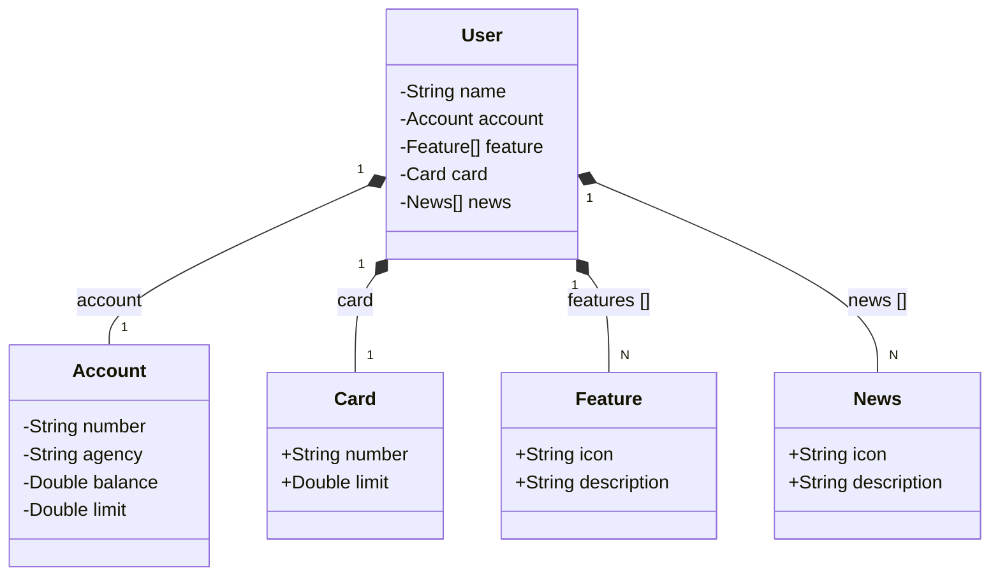

## Diagrama de Classes

```mermaid
classDiagram

class User {
  -String name
  -Account account
  -Feature[] feature
  -Card card
  -News[] news
}

class Account {
  -String number
  -String agency
  -Double balance
  -Double limit
}

class Card {
  +String number
  +Double limit
}

class Feature {
  +String icon
  +String description
}

class News {
  +String icon
  +String description
}

User "1" *-- "1" Account : account
User "1" *-- "1" Card : card
User "1" *-- "N" Feature : features []
User "1" *-- "N" News : news []

```

